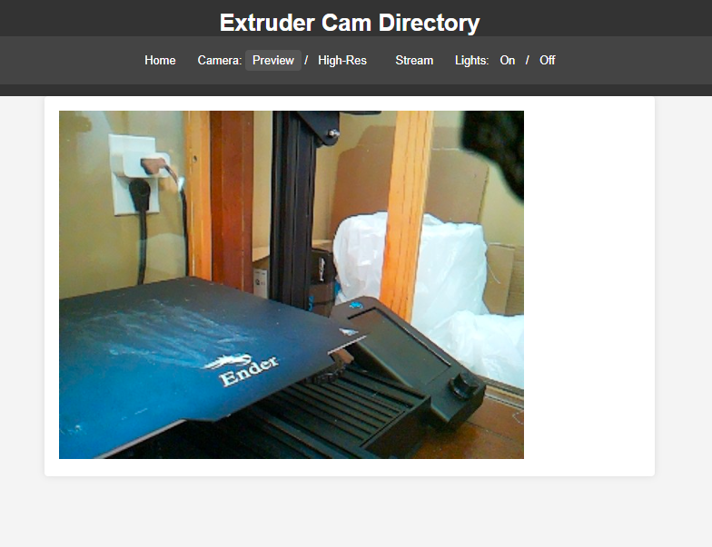

# 3D Printer Enclosure Control App

This application provides control over the lighting and camera functionalities for a 3D printer enclosure. It offers a user-friendly web server with a UI, and it's compatible with OctoPrint's classic webcam plugin.

## Features

- **Lighting Control**: Easily manage RGB lighting with on/off functionalities.
- **Camera Stream**: Stream live video from your 3D printer enclosure.
- **High-Resolution Images**: Capture high-resolution still images of your printing process.
- **User Interface**: A user-friendly web interface to control and monitor your 3D printer enclosure remotely.
- **Compatibility**: Works seamlessly with OctoPrint's classic webcam plugin.

## Prerequisites

- Python 3.x installed on your system.
- Required Python packages can be installed using pip. (Refer to the Installation section)

## Installation

1. FIRST: Prerequisites


    PyCamLights requires the following libraries:

    1. picamera2
    2. pigpio**
    3. numpy
    4. flask
    5. flask-socketio***


    ** pigpio must also be set up to run the required 'pigpiod' command on startup
   
    *** for future features

2. Clone the repository:
   ```bash
   git clone [repository-url]
   ```
3. Navigate to the project directory:
   ```bash
   cd [project-directory]
   ```
4. Install the required Python packages:
   ```bash
   pip install -r requirements.txt
   ```

## Usage

1. Start the application by running the following command:
   ```bash
   python app.py
   ```
2. Access the web interface by navigating to `http://localhost:8080` in your web browser.
3. Use the navigation menu to control lighting, access the camera stream, and capture images.

### Routes

- **Set Lighting**: `http://localhost:8080/lights/set?red=VALUE&green=VALUE&blue=VALUE`
- **Turn Off Lighting**: `http://localhost:8080/lights/off`
- **Turn On Lighting**: `http://localhost:8080/lights/on`
- **Access Camera Stream**: `http://localhost:8080/stream`
- **Capture Still Image**: `http://localhost:8080/camera?res=low` (Low resolution) or `http://localhost:8080/camera?res=high` (High resolution)

## Compatibility

This application is designed to work with OctoPrint's classic webcam plugin, providing enhanced control and monitoring capabilities for your 3D printer enclosure.

## Contributing

Contributions are welcome! Please feel free to submit issues or pull requests to improve this application.

## License

This project is licensed under the MIT License - see the [LICENSE](LICENSE) file for details.
